# The Swedish Quiz

The quiz has three options for each question to choose from and when the user chooses the correct option, it is displayed in green, if incorrect red, and in addition, the correct option is colored in green.

The Quiz has instructions lined out which is shown in a modal.

It is responsive to most common screen sizes.

The live site can be fount at [The Swedish Quiz](https://malinchristina.github.io/p2-the-swedish-quiz/).

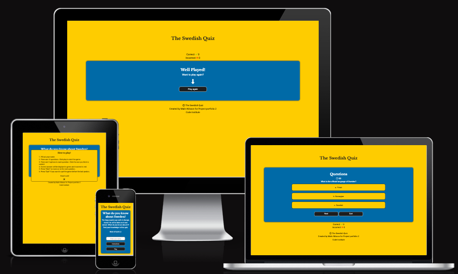

## UX

Overall a yellow and blue color theme is chosen to match the Swedish colors. Buttons are styled the same throughout for a uniform user experience. Modals are used to:

* Alert the user to input their name before the quiz can start.
* To choose an answer before moving on to the next question.
* Alert the user that times up if no answer has been choosen within 30 seconds.

## Features

* The header with the title name is visible at all time and with a link back to landing page.
* The footer is visible at all time.

### Favicon

A yellow question mark on blue background to match the site content.

### Welcome page

* The welcome page has a short inviting text to get the user to play the game. It contains:
  * An input field for the users name.
  * An instructions button.
  * A play button to start the game.

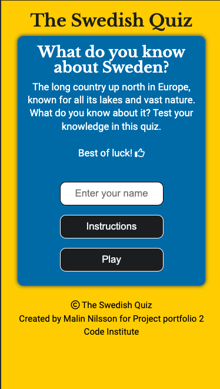

* A modal is instructing the user to enter the name.

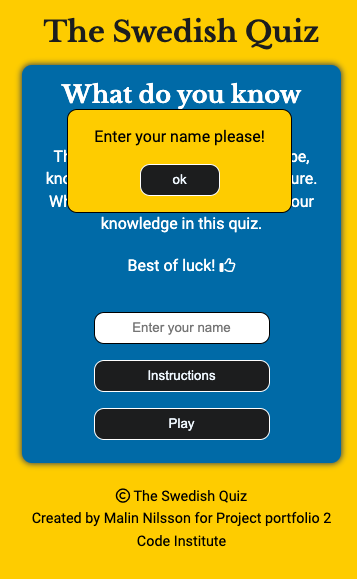

* Entered name.

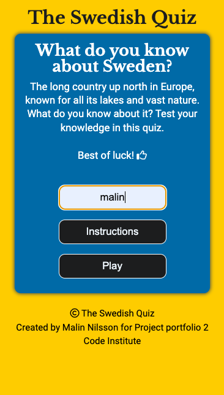

### Instructions

* The instructions inform the user of how to play the game with clear instructions.

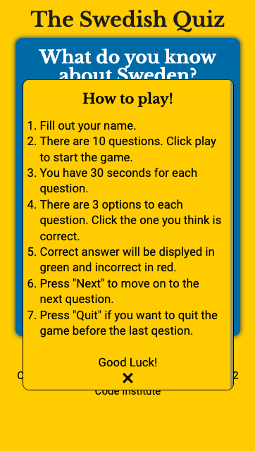

### Questions page

* The questions page show the timer, questions, options and points for correct/incorrect answers.
* Next button takes the user to the next question.
* Quit button ends the game.

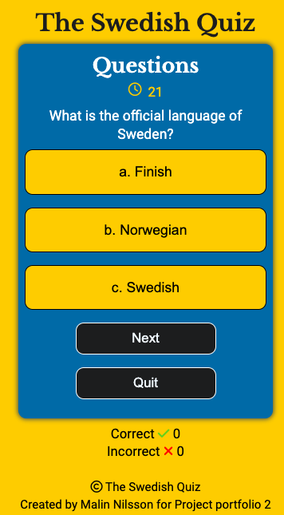

* The options are colored to indicate correct/incorrect answer.
  * Green for correct.
  * Red for incorrect. If the user has chosen incorrect, the green will show correct answer for the user to learn.

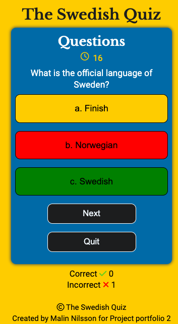

* A modal to inform the user to choose an answer before moving on to the next question.

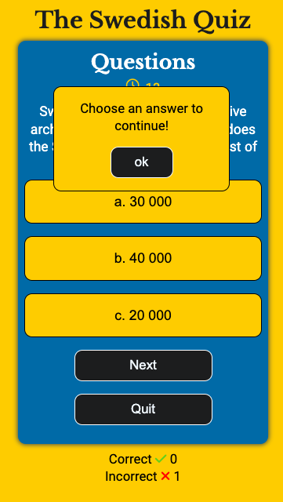

* A modal to inform the user that time is up and the game is over.

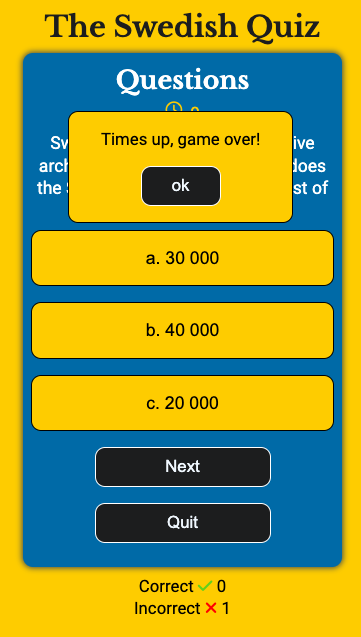

### End game page

* End game page with encouragement to the user to play again.

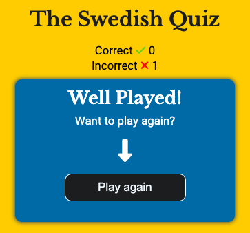

### 404 page

* A 404 page is displayed if the user navigates to a broken link.

## Wireframe

* Game area

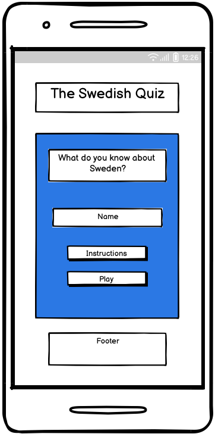

* Quiz area

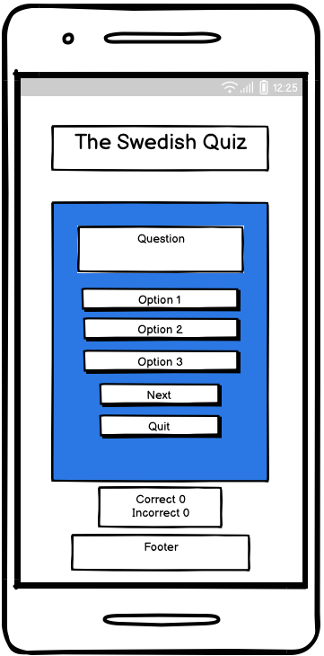

* Resume area
  
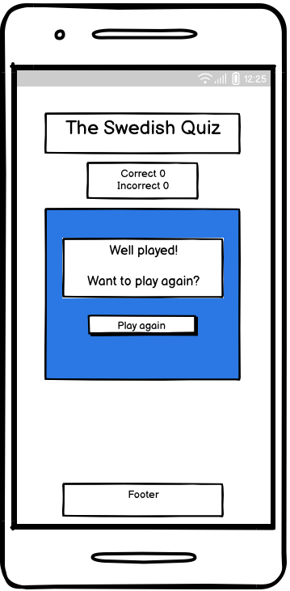

## Technology

* HTML
  * The structure of the site was developed by using HTML.
* CSS
  * The design of the site was developed by using CSS.
* JavaScript
  * The interaction of the site was developed with JavaScript.
* GitHub
  * The source code is hosted and deployed on GitHub
* Font Awesome
  * Icons used as thumbs up and arrow are sourced from [Font Awesome](https://fontawesome.com/).
* Balsamiq
  * Balsamiq was used to create basic wireframes.

## Testing

| Page   | Test   | Completed successfully
|--------|-------|:----:
| All | Header navigates to landing page | Yes
| All | Site is responsive on mobile and 768px and 992px | Yes
| Landing page | Instruction button shows instructions, and close on X | Yes
| Landing page | Input field allows for input name | Yes
| Landing page | Modal shows if play button is clicked without entering a user name, ok close modal | Yes
| Landing page | Game starts when user clicks 'Play' button| Yes
| Questions page | Timer starts, then stops when an option is chosen | Yes
| Questions page | Questons are shuffled | Yes
| Questions page | Options are colored green/red to indicate correct/incorrect answer| Yes
| Questions page | Score increments number of correct and incorrect answers| Yes
| Questions page | Modal shows if 'Next' button is clicked before an answer is chosen | Yes
| Questions page | 'Next' button shows the next question | Yes
| Questions page | 'Quit' button ends game and show end game page | Yes
| End game page | Shows the total correct/incorrect score | Yes
| End game page | 'Play again' button start the game again, and reset scores, username and timer | Yes

### Validator

* Html Checker
  * No errors or warnings for HTML, [Html validator](https://validator.w3.org/nu/?doc=https%3A%2F%2Fmalinchristina.github.io%2Fp2-the-swedish-quiz%2F)

* The W3C CSS Validation Service.
  * No error for CSS, [CSS validator](https://jigsaw.w3.org/css-validator/validator?uri=https%3A%2F%2Fmalinchristina.github.io%2Fp2-the-swedish-quiz%2F&profile=css3svg&usermedium=all&warning=1&vextwarning=&lang=en)
  
* WAVE
  * WAVE warned about empty form label for name input field which was correct with a span. [WAVE](https://wave.webaim.org/report#/https://malinchristina.github.io/p2-the-swedish-quiz/)
  
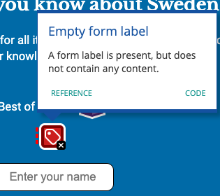

* JSHint
  * Warning on row 8 is bypassed as the function is from Love Maths
  * Warning on row 124 'object spread property' is solved by using Object.assign instead.
  * Undefined variable is due to the variable being in a separete js file.

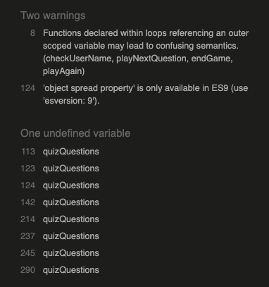

### Lighthouse

### Unfixed bugs

* Nothing to report.

## Deployment

The site was created on Code Anywhere and pushed and deployed to GitHub.

In the repository:

* Choose settings

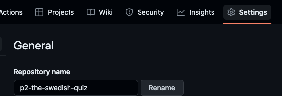

* On the left side bar, choose pages.

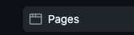

* Under Source, select Deploy from a branch.
* Under branch, the selection was chosen as shown in the image.

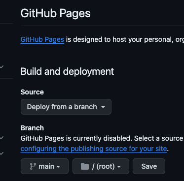

* Save.
* Go back to code in the menu.
* Find the deployed page on the right side under Deployments.

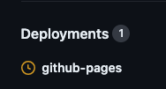

## Resources, References and Credit

Modal from [w3 schools](https://www.w3schools.com/howto/tryit.asp?filename=tryhow_css_modal)

Inspiration and structure:

* Love Maths
* [Udemy](https://www.udemy.com/course/javascript-the-complete-guide-2020-beginner-advanced/)
* [Web Dev Simplified](https://www.youtube.com/watch?v=riDzcEQbX6k)
* [GreatStack](https://www.youtube.com/watch?v=PBcqGxrr9g8)
* [Simple Steps Code](https://simplestepscode.com/javascript-quiz-tutorial/)

Other student's work that has inspired:

* https://lienebriede.github.io/smart-panda-quiz/
* https://aylamccarthy.github.io/all-about-pokemon/
* https://asyaharoyan.github.io/gravity-guru/ Classes visible and hide in CSS.

## Content

The questions with correct answers have been generated in ChatGPT. The incorrect options is added by the creator.
